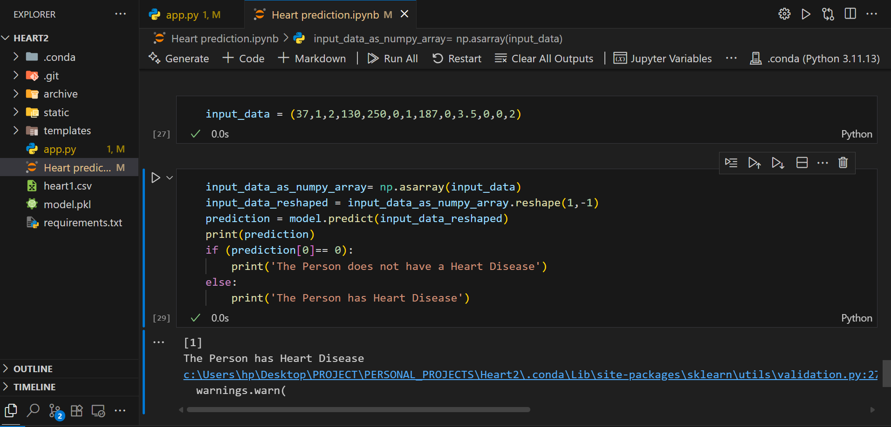
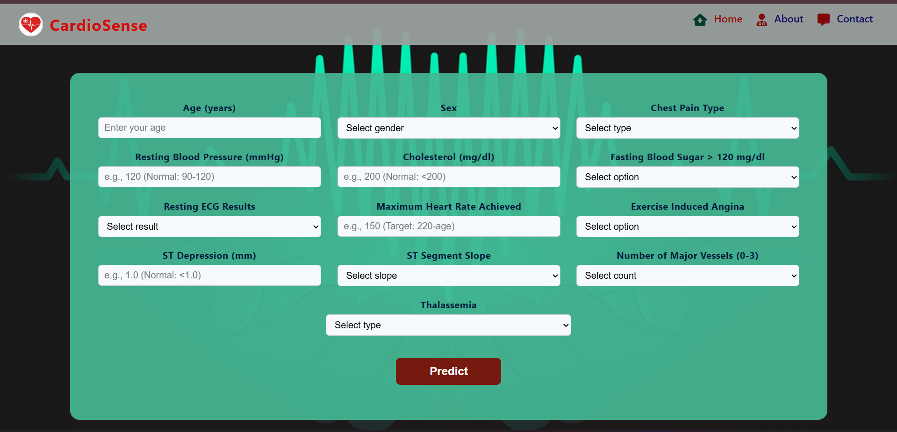
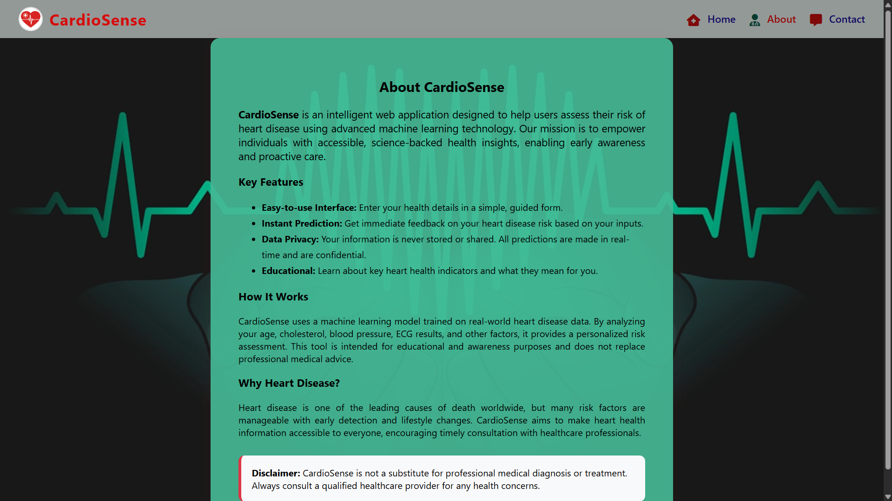
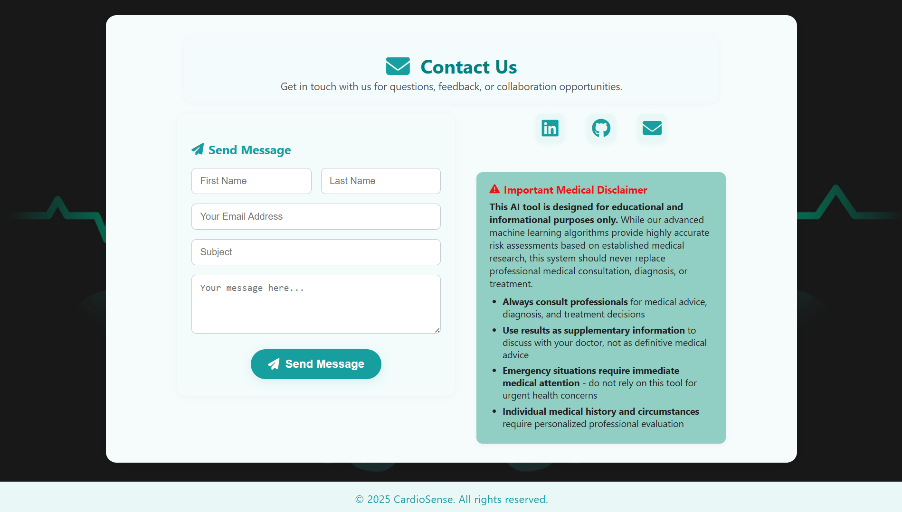
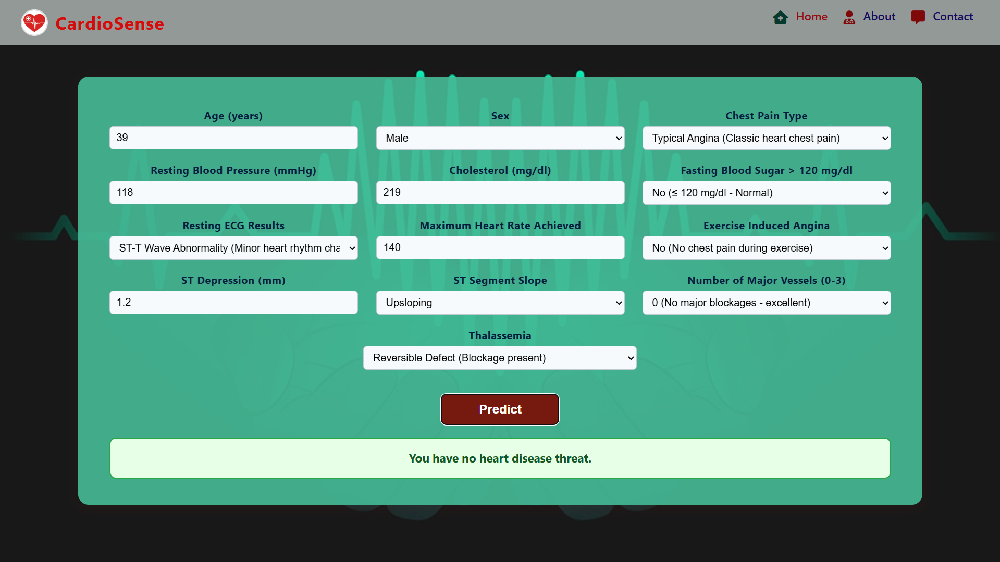

# CardioSense

CardioSense is an intelligent web application that predicts the risk of heart disease using machine learning. It features a user-friendly interface, instant predictions, and educational content to help users understand their heart health.

---

## Project Structure

- `app.py` — Flask backend for prediction and routing
- `templates/` — HTML templates (UI pages)
- `static/` — CSS and static assets
- `img/` — Screenshots and demo images
- `model.pkl` — Trained ML model
- `heart1.csv` — Dataset used for training

---

## Screenshots

### 1. Code Structure


### 2. Home Page


### 3. About Page


### 4. Contact Page


### 5. Prediction: Heart Disease Detected


### 6. Prediction: No Heart Disease


---

## Features
- Simple and modern UI
- Real-time heart disease risk prediction
- Data privacy: no data is stored
- Educational content about heart health

---

## How to Run
1. Install requirements:
   ```bash
   pip install -r requirements.txt
   ```
2. Start the Flask app:
   ```bash
   python app.py
   ```
3. Open your browser and go to `http://127.0.0.1:5000/`

---

## Disclaimer
CardioSense is for educational and awareness purposes only. It does not replace professional medical advice. Always consult a healthcare provider for medical concerns.
